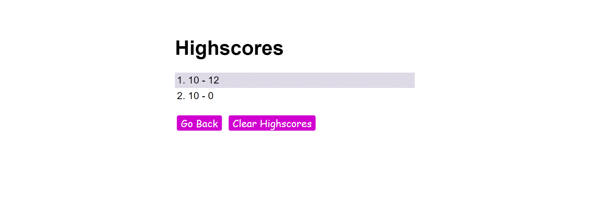

# Web-APIs-CodeQuiz

## Description 

JS  assessment, Testing your knowledge of Javascript by answering a series of questions. Start the quiz.

### Instruction 

GIVEN I am taking a code quiz
WHEN I click the start button
THEN a timer starts and I am presented with a question
WHEN I answer a question
THEN I am presented with another question
WHEN I answer a question incorrectly
THEN time is subtracted from the clock
WHEN all questions are answered or the timer reaches 0
THEN the game is over
WHEN the game is over
THEN I can save my initials and score

#### Project Links

* Repository Name
Web-APIs-CodeQuiz

* Live Site
https://haillander.github.io/Web-APIs-CodeQuiz/

* GitHub Environment
https://github.com/Haillander

* GitHub Repository
https://github.com/Haillander/Web-APIs-CodeQuiz

* Images

